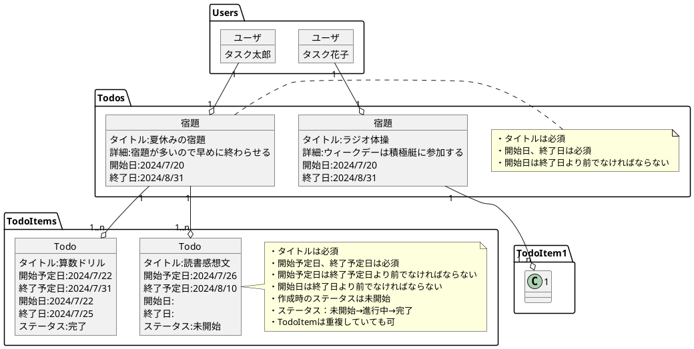
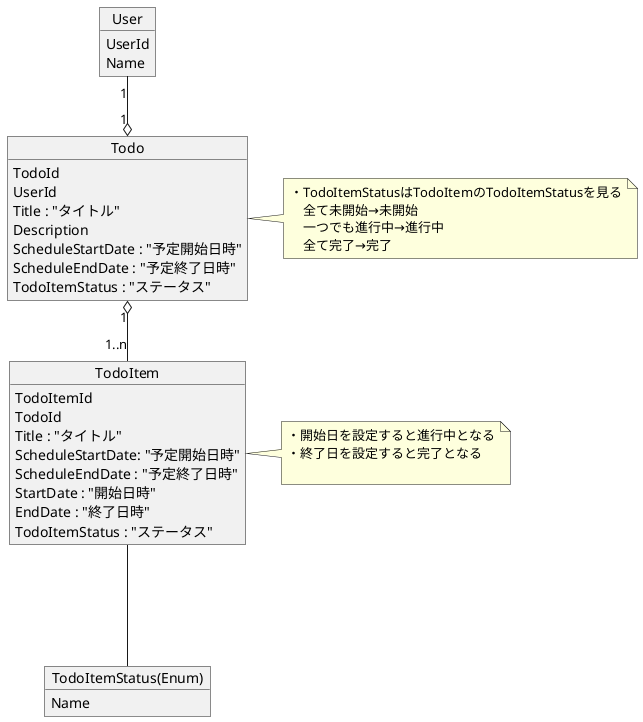

# Todo

- [Todo](#todo)
  - [ユースケース](#ユースケース)
  - [オブジェクトモデル](#オブジェクトモデル)
  - [ドメインモデル](#ドメインモデル)

## ユースケース

## オブジェクトモデル

```plantuml
@startuml

    package Users{
        object "ユーザ" as User1{
            タスク太郎
        }

        object "ユーザ" as User2{
            タスク花子
        }
      
    }
    package Todos{
        object "宿題" as Todos1{
            タイトル:夏休みの宿題
            詳細:宿題が多いので早めに終わらせる
            開始日:2024/7/20
            終了日:2024/8/31
        }

        note right of Todos1
            ・タイトルは必須
            ・開始日、終了日は必須
            ・開始日は終了日より前でなければならない
        end note

        object "宿題" as Todos2{
            タイトル:ラジオ体操
            詳細:ウィークデーは積極艇に参加する
            開始日:2024/7/20
            終了日:2024/8/31
        }

    }

    package TodoItems{
        object "Todo" as TodoItem1{
            タイトル:算数ドリル
            開始予定日:2024/7/22
            終了予定日:2024/7/31
            開始日:2024/7/22
            終了日:2024/7/25
            ステータス:完了
        }

        object "Todo" as TodoItem2{
            タイトル:読書感想文
            開始予定日:2024/7/26
            終了予定日:2024/8/10
            開始日:
            終了日:
            ステータス:未開始
        }

        note right of TodoItem2
            ・タイトルは必須
            ・開始予定日、終了予定日は必須
            ・開始予定日は終了予定日より前でなければならない
            ・開始日は終了日より前でなければならない
            ・作成時のステータスは未開始
            ・ステータス：未開始→進行中→完了
            ・TodoItemは重複していても可
        end note

        object "Todo" as TodoItem1.1{
            タイトル:第一週
            開始予定日:2024/7/22
            終了予定日:2024/7/26
            開始日:
            終了日:
            ステータス:未開始
        }

    }
    User1 "1" --o "1" Todos1
    User2 "1" --o "1" Todos2

    Todos1 "1" --o "1..n" TodoItem1
    Todos1 "1" --o "1..n" TodoItem2

    Todos2 "1" --o "1..n" TodoItem1.1
@enduml
```

## ドメインモデル

```plantuml
@startuml

    object "User" as User{
        UserId
        Name
    }

    object "Todo" as Todo{
        TodoId
        UserId
        Title : "タイトル"
        Description
        ScheduleStartDate : "予定開始日時"
        ScheduleEndDate : "予定終了日時"
        TodoItemStatus : "ステータス"
    }

    note right of Todo
        ・TodoItemStatusはTodoItemのTodoItemStatusを見る
            全て未開始→未開始
            一つでも進行中→進行中
            全て完了→完了
    end note

    object "TodoItem" as TodoItem{
        TodoItemId
        TodoId
        Title : "タイトル"
        ScheduleStartDate: "予定開始日時"
        ScheduleEndDate : "予定終了日時"
        StartDate : "開始日時"
        EndDate : "終了日時"
        TodoItemStatus : "ステータス"
    }

    note right of TodoItem
        ・開始日を設定すると進行中となる
        ・終了日を設定すると完了となる
        
    end note

    object "TodoItemStatus(Enum)" as TodoItemStatus{
        Name
    }

    User "1" --o "1" Todo
    Todo "1" o-- "1..n" TodoItem
    TodoItem --- TodoItemStatus
@enduml
```
